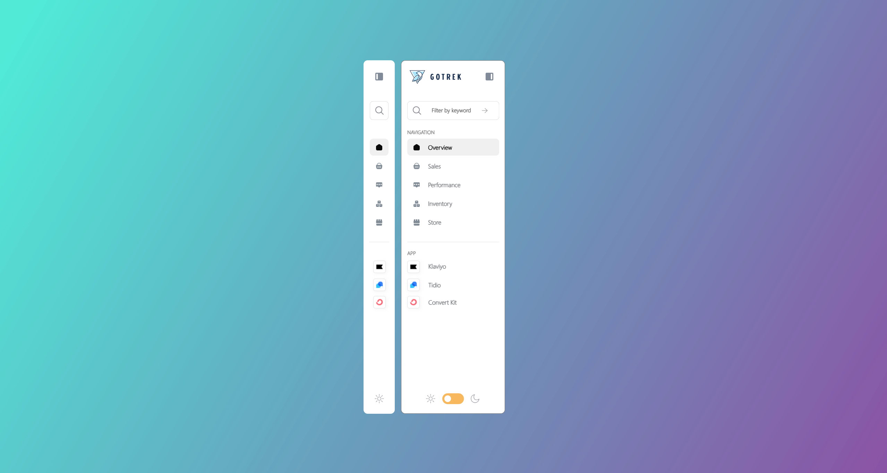

# 📊 Sidebar

**Date:** 2025-11-04  
**Version:** 1.0.0

---

## 📝 Description

A new **Power BI sidebar navigation pattern** designed for a modern, web-app-style experience.  
Built with native Power BI features and a single marketplace visual, it delivers a **collapsible, context-aware menu** that enhances navigation flow and user focus.

🎥 **Demo video:** [Watch on GitHub](https://github.com/nick-doccrs/PBIShare/issues/4#issue-3588001010)

---

## 📂 File List

- `Sidebar.pbix` – Power BI Desktop file  
- `Icons.zip` – Folder containing all icons used in the design  

---

## ⚡ Power BI Requirements

- Power BI Desktop (November 2025 or later)  
- One marketplace visual required:  
  [**Advanced Toggle Switch by TME AG**](https://tme-ag.de/tme-toggle-switch/)

---

## 🧭 How to Use

1. Download both the `.pbix` and `Icons.zip` files.  
2. Extract `Icons.zip` and update image paths in the PBIX if necessary.  
3. Install **Advanced Toggle Switch by TME AG** from AppSource.  
4. Open the `.pbix` file in Power BI Desktop to explore and adapt the sidebar layout.

---

## 🌗 Dark Mode Ready

This design includes a **dark mode toggle layout** ready to implement.  
Dark mode is **not currently functional**, but can be easily enabled using **conditional formatting** on colors and backgrounds tied to the toggle state.

---

## 🧩 Design Principles

- **Law of Common Region** – visually groups related navigation items.  
- **Jakob’s Law** – aligns with user expectations from modern web apps.  
- **Aesthetic–Usability Effect** – clean visuals promote confidence and ease of use.  
- **Fitts’ Law** – larger click targets improve navigation speed and accuracy.  

---

## 📝 Notes

- Designed for flexible reuse in other Power BI reports.  
- All icons are local — no external links.  
- Icons: Flaticon - Uicons by <a href="https://www.flaticon.com/uicons">Flaticon</a>  
- Background: <a href="https://www.freepik.com/free-vector/green-purple-gradient-background_43181516.htm#fromView=keyword&page=1&position=14&uuid=2387d2fc-9b0b-4e96-a2c4-e41663e0f796&query=Ombre">Image by juicy_fish on Freepik</a>

---

## ⭐ Support

If you find this useful, **star the repository** to stay updated.  
Support future Power BI UI/UX templates and free community resources here:

  
   
  Every coffee helps keep new Power BI design patterns coming.

